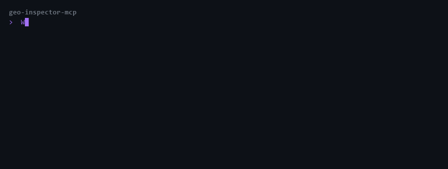

# geo-inspector-mcp

[](https://www.npmjs.com/package/geo-inspector-mcp)
[](https://registry.modelcontextprotocol.io)
[](LICENSE)

**An MCP server that gives an AI assistant four tools for inspecting how a website presents itself to other AI systems**: which AI crawlers it blocks, whether it publishes llms.txt, what schema markup it ships, and how its indexing directives are set.

Published on npm and listed in the official [MCP Registry](https://registry.modelcontextprotocol.io) as `io.github.Bigsupe55/geo-inspector-mcp`. Works with Claude Code, Claude Desktop, or any MCP client.



<sub>Tool output above is verbatim from a live run against nytimes.com, docs.anthropic.com,
and stripe.com, captured by driving the built server over MCP stdio. The sitemap list is
collapsed to a count; nothing else is edited. Regenerate with <code>npm run demo</code>.</sub>

## Why this exists

AI assistants are becoming a primary way people find and cite content, and sites signal their intent to AI systems through a handful of plumbing files: robots.txt rules for AI crawlers, the emerging llms.txt standard, schema.org structured data, and meta directives. Checking those by hand means juggling curl, a robots.txt parser in your head, and view-source. This server turns all of it into questions you can just ask Claude.

## Quickstart

```bash
npx -y geo-inspector-mcp
```

That is the whole install. Point your MCP client at it:

**Claude Code**

```bash
claude mcp add geo-inspector -- npx -y geo-inspector-mcp
```

**Claude Desktop** (`claude_desktop_config.json`)

```json
{
  "mcpServers": {
    "geo-inspector": {
      "command": "npx",
      "args": ["-y", "geo-inspector-mcp"]
    }
  }
}
```

Then ask things like: "Which AI crawlers does nytimes.com block?" or "Does stripe.com publish an llms.txt?"

## Tools

| Tool | What it checks | Example question |
| --- | --- | --- |
| `check_robots_txt` | Which AI crawlers (GPTBot, ClaudeBot, PerplexityBot, Google-Extended, CCBot, and more) are allowed or blocked, per RFC 9309, plus sitemaps | "Can OpenAI train on example.com?" |
| `fetch_llms_txt` | Presence and spec-validity of /llms.txt and /llms-full.txt | "Has example.com adopted llms.txt?" |
| `detect_schema_markup` | JSON-LD blocks, schema.org type inventory, AI-relevant types, sameAs disambiguation | "What structured data does this article have?" |
| `check_meta_directives` | Meta robots tags (including noai/noimageai and bot-specific tags) and X-Robots-Tag headers | "Is this page indexable?" |

Every tool returns a readable summary plus structured JSON (`structuredContent`) for programmatic use.

## How it is built

The interesting part of an MCP server is not the tools, it is the contract around them.

**Every tool returns two things.** A readable summary for the model to reason over, and
`structuredContent` for anything downstream that needs to compute. That split is what
lets a separate scoring layer ([ai-visibility-audit](https://github.com/Bigsupe55/ai-visibility-audit))
derive deterministic numbers from the same call the model is reading in prose. The model
never has to parse its own tool output back into data.

**Parsers are pure functions.** `robots.txt`, `llms.txt`, JSON-LD, and meta directives
each parse in isolation, with no I/O and fixture-based tests. A tool handler is a thin
shell: fetch, parse, format. This is what makes the behavior testable without a network,
and it is why the test suite runs with no fixtures to record and no site to hit.

**All network access goes through one helper.** A single fetch path with a size cap, a
redirect limit, and a timeout. An MCP server runs inside someone else's agent loop with
their API budget attached, so a tool that can hang or stream an unbounded response is a
tool that can ruin a session. One choke point means those limits cannot be forgotten in
a new tool.

**robots.txt parsing follows RFC 9309** rather than a regex, because the whole value of
the tool is being right about whether a specific crawler is allowed. Longest-match wins,
user-agent groups merge, and `Allow` can override a broader `Disallow`.

## Development

```bash
npm install
npm test        # vitest unit + integration tests
npm run build   # bundle to dist/
npx @modelcontextprotocol/inspector node dist/index.js   # poke it interactively
```

Parsers are pure functions with fixture-based tests; all HTTP goes through one capped, redirect-limited fetch helper.

### Regenerating the demo GIF

```bash
npm run demo          # build, capture, render
```

Or the steps separately:

```bash
npm run demo:capture  # drives the built server over MCP stdio, writes scripts/demo-data.json
npm run demo:render   # renders docs/demo.gif from that JSON (needs: pip install Pillow)
```

`demo-data.json` is committed, so rendering works offline and the GIF's claims stay
auditable: diff it against what the tools return today. The capture script mocks
nothing, so if a site changes its robots.txt, the demo changes with it. The only
authored text in the pipeline is the human question line; the sites to inspect are
configured at the top of `scripts/capture-demo.mjs`.

## Related

[ai-visibility-audit](https://github.com/Bigsupe55/ai-visibility-audit) is the workflow layer on top of this one: it orchestrates these four tools into a scored, client-ready report. This repo is the raw tools.

## License

MIT, see [LICENSE](LICENSE).
